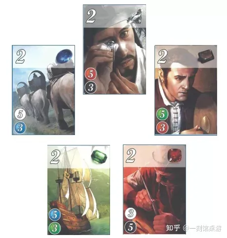

+++
title = '璀璨宝石牌型分析'
date = 2024-04-18T17:26:53+08:00
draft = false
+++

> 最近玩《璀璨宝石》有点上头，网上找到了一篇分析牌型的文章，转载于此便于学习

### 一．色环

璀璨宝石中的颜色存在相互关联性，五色色环如下：

——黑——红——绿——蓝——白——黑——红——绿——蓝——

为了后面叙述方便，顺时针下一个颜色称为顺临色，顺时针下两个颜色称为顺对色，逆时针下一个颜色称为逆临色，逆时针下两个颜色称为逆对色。以白色为例，黑色是白色的顺临色，红色是白色的顺对色，蓝色是白色的逆临色，绿色是白色的逆对色。

璀璨宝石设计的一大特点是卡牌上的宝石元素并不完全是镜像排列的，虽然五个颜色的卡牌数量一致，宝石和分数的模型一致，但是组合方式却并非完全一致，这赋予了各个颜色不同的“特性”。不同局势下，颜色之间关联的差异，使得玩家的策略更多变，增加了游戏的策略度和可玩性。

### 二．三级卡（20张）：

73：
3本色 7顺临（5）

游戏中唯一的5分卡，行动数量-分数比一般为7:5=1.4，是性价比最高的一张得分牌。但受制于宝石上限10，一般在中后期才有机会完成，不建议早期预留，一旦操作不好，很容易中期被卡住。

单7：
7顺临（4）

单色7换4分，行动数量-分数比一般为7:4=1.75，虽然性价比低于73，不过胜在只需要7枚宝石就可以完成，是有机会在前期就打出来解放一个预留位置的，在翻出的3级牌普遍较差的情况下可以考虑前期预留。

633：
6顺临 3本色 3顺对（4）

后期性价比比较高的一张牌，行动数量-分数比一般为6:4=1.5，由于需要12枚宝石，一般后期才有机会打出，可以作为收尾牌.

5333：
5顺对 3顺临 3逆对 3逆临（3）

几乎任何流派都不会作为核心的一张牌，行动数量-分数比一般为7:3=2.3，基本属于三级牌里的垃圾牌，极少数情况下贵族流收尾补分会选择它。

三级牌小结：三级牌整体五色排列非常整齐，没有体现出颜色之间的差异性。单看性价比三级牌都是非常高的，但受制于宝石数量和宝石上限，在没有低级牌支撑的情况下贸然冲三级牌是很容易卡住的，因此预留三级牌的时机和选择非常考验玩家对游戏节奏的把握。另外可以看到所有比较强的三级牌都对顺临色需求最大，那么在选定收尾三级牌颜色的同时，顺临色牌的价值也会随之变大。例如如果我想以三级绿牌收尾，那么本局前面我应尽量收集蓝宝石牌。

### 三．二级卡（30张）：

单6：
6本色（3）

二级牌中的最高分牌，行动数量-分数比一般为6:3=2，在二级牌中算是相当优秀的性价比了。另外本牌是本色生本色，属于强化颜色体系构成，对争夺三级牌和贵族都有益处，这点也侧面提高了它的价值。但是本牌需要6同色，完成难度是二级牌中最大的，前期预留需谨慎。

53：
绿：3本色 5顺临（2）
蓝：3本色 5顺临（2）
白：3顺临 5顺对（2）
黑：3顺临 5顺对（2）
红：3逆对 5逆临（2）

8宝石换2分，行动数量-分数比一般为6:2=3，性价比平平。二级牌中就开始出现有颜色差异的牌了，53牌中，绿蓝两色延续了和三级牌73牌相同的主顺临，辅本色的构成，而白黑红三色则几乎构成了一个三色闭环。本牌优先级不高，通常不需要前期预留。

单5：
绿：5本色（2）
蓝：5本色（2）
白：5顺对（2）
黑：5逆临（2）
红：5逆临（2）

5单色是最具代表性的颜色差异牌，直接分出了绿蓝和白黑红两个颜色阵营，行动数量-分数比一般为5:2=2.5，由于绿蓝的单5是强化本色，因此价值略高于白黑红。这张牌很直观的比楼上53少用3个宝石，加上黄金的压力对比单6要轻不少，前期可以考虑预留。

421：
4顺对 2顺临 1逆对（2）

个人认为的前期最强牌，行动数量-分数比一般为4:2=2，在有不俗性价比的同时对黄金的需求很低，只需要1个甚至0个黄金就可以完成，这使得前期421开局不但不会被卡，后续也非常灵活，进可快攻抢大分，退可卡金凑贵族。因为421的需求颜色构成和三级牌不相符，所以中后期421价值反而有所下降，但仍然是一张可选牌。

332：
3顺对 3逆临 2本色（1）

8宝石换1分，行动数量-分数比一般为4:1=4，较低的性价和混乱颜色需求比使得大部分情况下无人问津。

322：
绿：3顺临 2顺对 2逆对（1）
蓝：3逆对 2逆临 2本色（1）
白：3逆对 2顺临 2顺对（1）
黑：3逆临 2顺对 2逆对（1）
红：3逆临 2逆对 2本色（1）

和332类似的地位，行动数量-分数比一般为4：1=4，优势是唯二不需要黄金就可以获得的分数牌，在某些卡金卡得丧心病狂的局里会有不错的表现。

二级牌小结：二级牌作为既容易打出，分数性价比又高的牌，是游戏中争夺激烈的主要战场。其在游戏中需求量最大，轮换速度也最快，因此相对于另外两个等级，研究二级牌的颜色搭配是最重要也最常用的。在二级牌中的强牌里，可以明显看到绿蓝双色相对独立，而白黑红三色闭环相关联，自然而然的，绿蓝和白黑红就变成了冲分流里最常见的两组颜色搭配，它们不但互成体系，而且有更大的拿贵族机会。

### 四．一级卡（40张）：

单4：
4逆对（1）

一级牌里唯一有分的牌，行动数量-分数比一般为：4:1=4，考虑到有资源剩余，它的性价比甚至高于二级牌的332和322。从跑分的角度看前期单4的性价比不太够看，但是潜力巨大，到中后期，它每靠牌节省1资源，它的性价比就会有巨大的提升，关键时刻补分有奇效。也可以考虑前期先做，但是如果选择前期做一定要充分发挥它卡金的优势，争取把别人卡住，否则正常发育的情况下以它的性价比来说是比较吃亏的。

311：
绿：3顺临 1本色 1顺对
蓝：3逆临 1本色 1逆对
白：3本色 1顺临 1逆临
黑：3顺临 1本色 1顺对
红：3逆临 1本色 1逆对

0分一级卡中最昂贵的一张牌，前期在同颜色的一级卡中一般都是最后一个考虑的。但是到后期由于311的颜色需求比较科学，符合绿蓝，白黑红两种主流的颜色搭配，在争贵族补色的时候经常会有用武之地。

221：
2逆对 2逆临 1顺临

同样属于昂贵的0分一级牌，颜色搭配也不尽如人意，一般前期没有更好的选择时才会选择用它补色。

2111：
2逆对 1逆临 1顺临 1顺对

都说卡牌游戏没有完爆，但璀璨宝石里的2111确实被1111完爆。不过对于1级牌，重点是关键时刻需要它们来补色，价格多一点少一点往往是次要的。

22：
绿：2顺临 2逆临
蓝：2顺对 2逆临
白：2顺临 2逆临
黑：2顺对 2逆临
红：2本色 2逆对

比较便宜的一级牌，其中红22的颜色需求比较贴白黑红流派。

1111
1顺临 1顺对 1逆对 1逆临

比较便宜的一级牌，补色优先级很高。

单3：
绿：3逆临
蓝：3顺对
白：3逆临
黑：3顺对
红：3逆对

单3虽然只需3个宝石，但是做成的难度反而比需要4个宝石的一级牌大，所以优先级比较低，其中红单3比较贴白黑红流派。

21：
2顺对 1顺临

最便宜的一级牌，如果能拿到自己需要的颜色就是血赚。

一级牌小结：由于一级牌的价值主要是跟着翻出的三级牌和贵族走，因此很容易出现翻出的4张一级牌都没啥用从而卡住的局面。但是一级牌的更新速度慢也赋予了它物以稀为贵的特点，抢手颜色一级牌的价值不亚于，甚至高于一个黄金的价值。

### 总结

从卡牌上五色需求的规律来看，绿蓝和白黑红无疑是最高效的两个组合。其中绿蓝流前中期蓝牌价值更高一点，因为便于后期做对蓝需求大的绿牌，如果有44绿蓝贵族，先做蓝再做绿是节奏最好的。白黑红的完美节奏是优先做黑，后期由黑出高分白，再用黑白补红色一二级牌，完成333白黑红贵族。