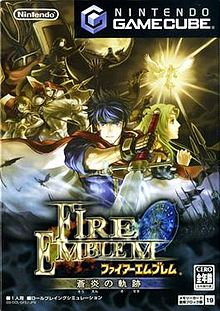

+++
title = '火焰纹章系列作品一览'
date = 2024-12-18T16:40:41+08:00
draft = false
+++

## 火焰之纹章：暗黑龙与光之剑

游戏名：

**Fire Emblem: Shadow Dragon and the Blade of Light**(EN)

**ファイアーエムブレム 暗黒竜と光の剣**(JP)

平台：FC

发售日期: 1990年4月20日

-----

## 火焰之纹章外传

游戏名：

**Fire Emblem Gaiden**(EN)

**ファイアーエムブレム外伝**(JP)

平台：FC

发售日期：1992年3月14日

-----

## 火焰之纹章：纹章之谜

游戏名：

**Fire Emblem: Mystery of the Emblem**(EN)

**ファイアーエムブレム 紋章の謎**(JP)

平台：SFC

发售日期: 1994年1月21日

-----

## 火焰之纹章：圣战之系谱

游戏名：

**Fire Emblem: Genealogy of the Holy War**(EN)

**ファイアーエムブレム　聖戦の系譜**(JP)

平台：SFC

发售日期: 1996年5月14日

-----

## 火焰之纹章：多拉基亚776

游戏名：

**Fire Emblem: Thracia 776**(EN)

**ファイアーエムブレム トラキア776**(JP)

平台：SFC

发售日期:1999年9月1日

-----

## 火焰之纹章：封印之剑

游戏名：

**Fire Emblem: The Binding Blade**(EN)

**ファイアーエムブレム 封印の剣**(JP)

平台：GBA

发售日期:2002年3月29日

-----

## 火焰之纹章：烈火之剑

游戏名：

**Fire Emblem**(EN-release)

**Fire Emblem: The Blazing Blade**(EN-translate)

**ファイアーエムブレム 烈火の剣**(JP)

平台：GBA

发售日期: 2003年4月25日

-----

## 火焰之纹章：圣魔之光石

游戏名：

**Fire Emblem: The Sacred Stones**(EN)

**ファイアーエムブレム 聖魔の光石**(JP)

平台：GBA

发售日期:2004年10月07日

-----

## 火焰之纹章：苍炎之轨迹

游戏名：

**Fire Emblem: Path of Radiance**(EN)

**ファイアーエムブレム 蒼炎の軌跡**(JP)

平台：NGC

发售日期:2005年4月20日

    
    

-----

## 火焰之纹章：晓之女神

游戏名：

**Fire Emblem: Radiant Dawn**(EN)

**ファイアーエムブレム 暁の女神**(JP)

平台：Wii

发售日期:2007年2月22日

    
    

-----

## 火焰之纹章：新·暗黑龙与光之剑

游戏名：

**Fire Emblem: Shadow Dragon**(EN)

**ファイアーエムブレム 新・暗黒竜と光の剣**(JP)

平台：NDS

发售日期: 2008年8月3日

    
    

-----

## 火焰之纹章：新·纹章之谜～光与影的英雄～

游戏名：

**Fire Emblem: New Mystery of the Emblem**(EN)

**ファイアーエムブレム 新・紋章の謎 〜光と影の英雄〜**(JP)

平台：NDS

发售日期: 2010年7月15日

-----

## 火焰之纹章 觉醒

游戏名：

**Fire Emblem: Awakening**(EN)

**ファイアーエムブレム 覚醒**(JP)

平台：3DS

发售日期：2012年4月19日

    
    

-----

## 火焰之纹章 if

> 包含白夜王国/暗夜王国双版本及dlc透魔王国

游戏名：

**Fire Emblem Fates:Birthright / Conquest / Revelation**(EN)

**ファイアーエムブレム if 白夜王国 / 暗夜王国 / インビジブルキングダム**(JP)

平台：3DS

发售日期：2015年6月25日

    
    

    
    

-----

## 火焰之纹章回声：另一位英雄王

游戏名：

**Fire Emblem Echoes: Shadows of Valentia**(EN)

**ファイアーエムブレム Echoes もうひとりの英雄王**(JP)

平台：3DS

发售日期：2017年4月20日

    
    

-----

## 火焰之纹章 风花雪月

游戏名：

**Fire Emblem: Three Houses**(EN)

**ファイアーエムブレム 風花雪月**(JP)

平台：NS

发售日期：2019年7月26日

    
    
    

-----

## 火焰之纹章：结合

游戏名：

**Fire Emblem: Engage**(EN)

**ファイアーエムブレム エンゲージ**(JP)

平台：NS

发售日期：2023年1月20日

    
    
    <!--  -->

