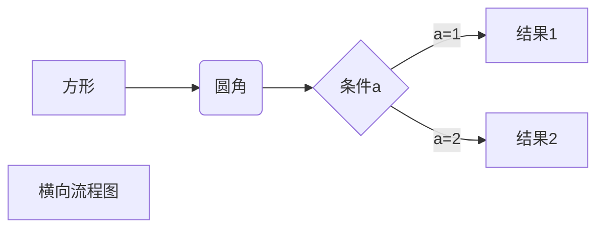
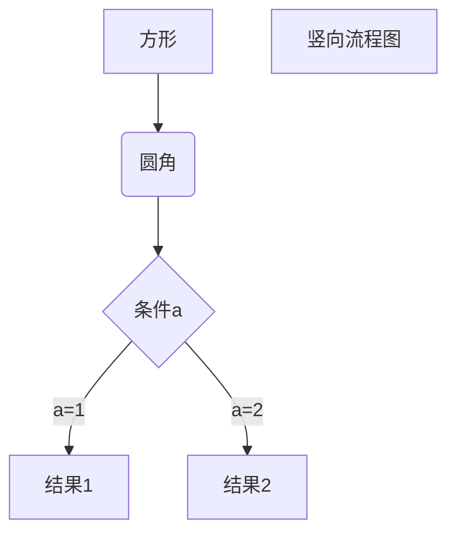
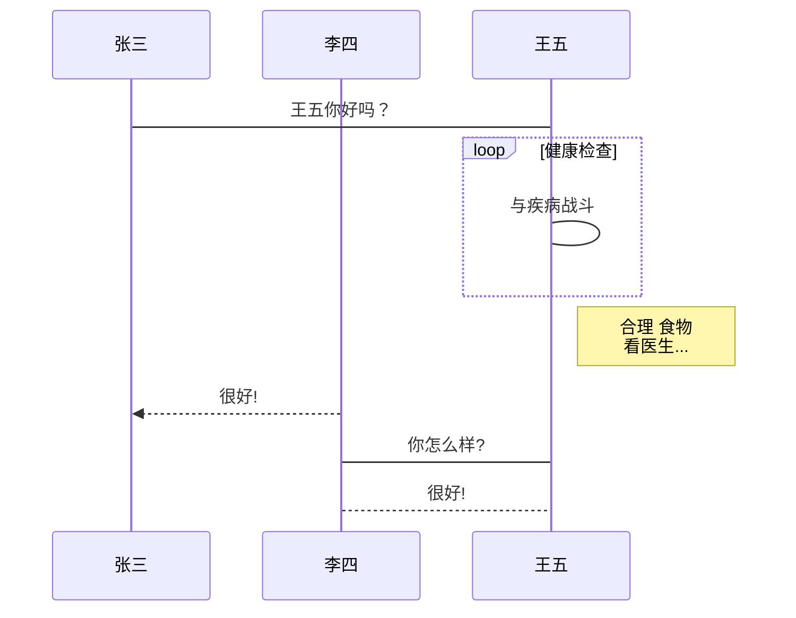
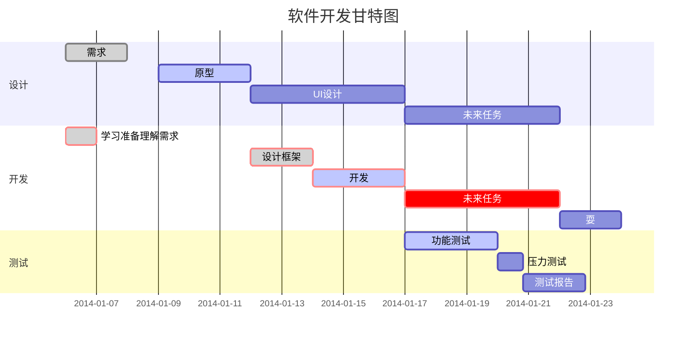

+++
title = 'Markdown语法兼容性测试'
date = 2024-04-03T15:36:21+08:00
draft = false
+++

> 使用Hugo构建于Github Pages

不同Hugo主题对Markdown语法的支持程度不同，因此本页面用于检测不同Markdown语法在本主题中的兼容情况


## 语言分块

All I can think about is you!  

Well down!
It's good!  

Next paragraph!

## **斜体**

*well down*

## 分割线

***

---

* * *

## 粗体

**good**

## 粗斜体

***well***

## 横线

~~well~~ 

## 下划线

<u>underline</u>

## 脚注

要介绍的是[^Nintendo]

## 列表

1. 第一点
2. 第二点
   1. 第二第一
      1. 211
         1. wo
            1.  wowo
                1. wo
            2.  牛啊
         2. good
      2. 212
   2. 第二第二
      * ho
      * ho again
3. 第三点
4. 第四点

## 区块引用

> 区块引用
>
> 这真是太棒了
>
> > 内部嵌套
> >
> > 哇哦

## 函数块

`printf()`是一个C语言函数

## 代码块

```c++
int a = 0;
void printALL{
	for(int i = 0 ;i < a;i++){
		cout << "Ho";
	}
}
```

## 链接

百度官方网站[百度](https://www.baidu.com)

<https://www.baidu.com>

这个链接[good][1]

## 图片


## 表格

|   title1    |   title2   |    title3    |
| :---------: | :--------: | :----------: |
| one  things | two things | three things |
|    first    |   second   |    third     |

## 键盘块

<kbd>shift</kbd> and <kbd> del </kbd> = <kbd> S </kbd>  

## Latex

$$
\mathbf{V}_1 \times \mathbf{V}_2 =  \begin{vmatrix} 
\mathbf{i} & \mathbf{j} & \mathbf{k} \\
\frac{\partial X}{\partial u} &  \frac{\partial Y}{\partial u} & 0 \\
\frac{\partial X}{\partial v} &  \frac{\partial Y}{\partial v} & 0 \\
\end{vmatrix}
{$tep1}{\style{visibility:hidden}{(x+1)(x+1)}}
$$

## Mermaid

### 横向流程图



### 纵向流程图



### 标准纵向流程图

```flow
st=>start: 开始框
op=>operation: 处理框
cond=>condition: 判断框(是或否?)
sub1=>subroutine: 子流程
io=>inputoutput: 输入输出框
e=>end: 结束框
st->op->cond
cond(yes)->io->e
cond(no)->sub1(right)->op
```

### 标准横向流程图

```flow
st=>start: 开始框
op=>operation: 处理框
cond=>condition: 判断框(是或否?)
sub1=>subroutine: 子流程
io=>inputoutput: 输入输出框
e=>end: 结束框
st(right)->op(right)->cond
cond(yes)->io(bottom)->e
cond(no)->sub1(right)->op
```

## UML时序图

```sequence
对象A->对象B: 对象B你好吗?（请求）
Note right of 对象B: 对象B的描述
Note left of 对象A: 对象A的描述(提示)
对象B-->对象A: 我很好(响应)
对象A->对象B: 你真的好吗？
```

```sequence
Title: 标题：复杂使用
对象A->对象B: 对象B你好吗?（请求）
Note right of 对象B: 对象B的描述
Note left of 对象A: 对象A的描述(提示)
对象B-->对象A: 我很好(响应)
对象B->小三: 你好吗
小三-->>对象A: 对象B找我了
对象A->对象B: 你真的好吗？
Note over 小三,对象B: 我们是朋友
participant C
Note right of C: 没人陪我玩
```



## 甘特图




## 脚注尾部

[1]: www.baidu.com

[^Nintendo]:  A game company


