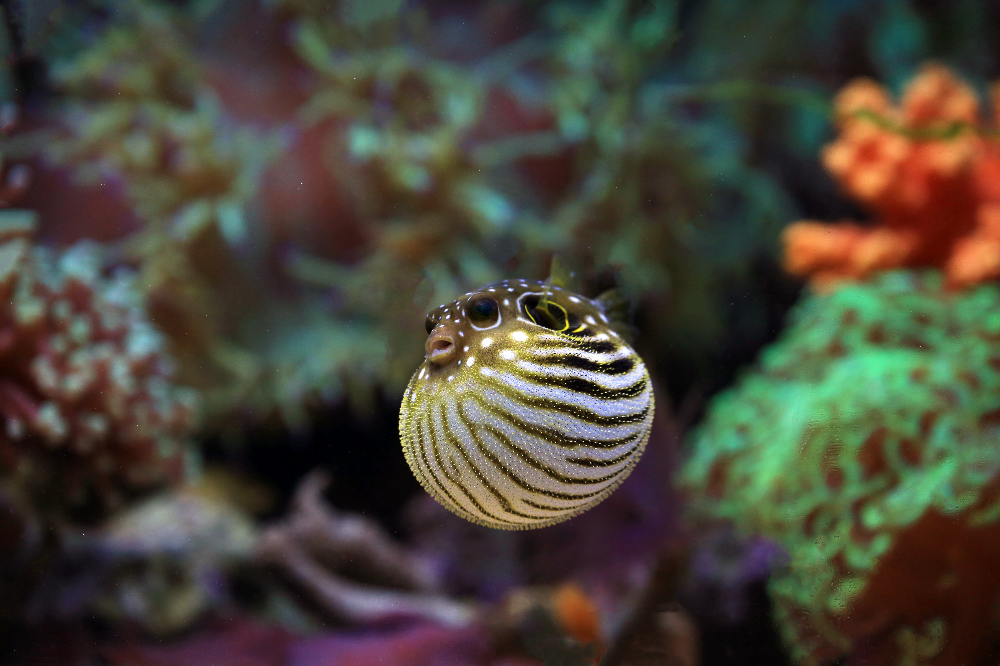

+++
title = 'Hello World'
date = 2024-04-03T15:36:21+08:00
draft = false
tags = ["测试", "Markdown"]
series = ["测试用内容"]
series_order = 1
+++

## 你好，世界！

这是本站的第一篇推文，使用Hugo构建于Github Pages

本文的剩余部分用于测试**本主题(Blowfish)**独有的语法功能


测试警告语句



这是第一篇推文 
现在是测试Typeit动态效果的部分


测试Timeline语句




2024.04.02 于Github建立网站代码仓库



2024.04.03选取构建代码引擎
<ul>
  <li>Jekyll-Hydejeck</li>
  <li>Hugo-Blowfish</li>
</ul>



2024.04.03上传第一篇推文
测试Timeline内添加gallery

  
  
  





测试嵌入Youtube视频



