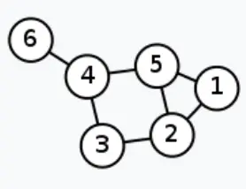

+++
title = 'Gnn_pt1'
date = 2024-04-07T23:41:06+08:00
draft = false
+++

## 图神经网络学习笔记（1）

### 图网络

#### 背景

​	常见的神经网络，如BP神经网络可以用来处理表格型的数据，卷积神经网络可以用来处理图片数据，循环神经网络则可以用来处理序列数据，这些数据都是结构化的数据，当我们需要处理的数据为图这种**非结构化**的数据，例如：城市交通的每个路口上的传感器所记录的数据；化学分子结构；人际关系网；推荐系统中每个人构成的图。并不是说以上的神经网络处理不了图这种类型的数据，只是在处理图这种数据上存在欠缺，图数据有一个很明显的特征，相邻或相近的节点存在一定的空间依赖关系，这种关系传统神经网络很难捕获。为了获取表示这种特征关系，图网络就此诞生。

#### 内容

​	图网络的核心思想就是**依据图结构的空间依赖关系来表征现实世界中真实的特征之间的相互作用关系，通过对节点特征进行聚合生成新的节点特征表示**用于后续工作。

​	下图为一张交通系统的图结构，在6个位置上分别有一个传感器记录了一段时间的交通流量数据，现在的目标是要预测接下来每个位置上未来一段时间的流量。如果从传统的时间序列模型来思考，未来的数据一定是与过去的数据相关，因此我们可以对6个位置的时间序列单独进行预测生成6个位置未来的预测值，但是这样就没有考虑到节点之间的空间依赖关系。既然已经用图结构表示出了这种空间关系，那么我们怎么去应用它？这就是图网络所要解决的问题。

<!--  -->

### GCN(Graph Convolutional Network)

>  论文：https://arxiv.org/pdf/1609.02907.pdf

​	GCN（图卷积神经网络），实际上跟CNN（卷积神经网络）的作用一样，就是一个特征提取器，只不过它的对象是图数据。GCN精妙地设计了一种从图数据中提取特征的方法，从而让我们可以使用这些特征去对图数据进行节点分类（node classification）、图分类（graph classification）、边预测（link prediction），还可以顺便得到图的嵌入表示（graph embedding）。下图为GCN和输入图像数据的CNN间的对比。

<!--  -->

#### 计算原理

​	假设有一批图数据，其中有N个节点（node），每个节点都有自己的特征，假设特征一共有D个，我们设这些节点的特征组成一个N×D维的矩阵X，然后各个节点之间的关系也会形成一个N×N维的矩阵A，也称为邻接矩阵（adjacency matrix）。X和A便是我们模型的输入。

GCN算法的步骤简单可总结为：聚类、更新、循环

设输入为X，网络权重为W，则一层的BP网络可以表示为 $ f = \sigma(XW) $ ；图卷积网络可以表示为： $ f = \sigma(AXW) $，其中A为图结构的表示矩阵。他们分别是什么含义？

# 更新中

信息传播

邻接矩阵

度矩阵