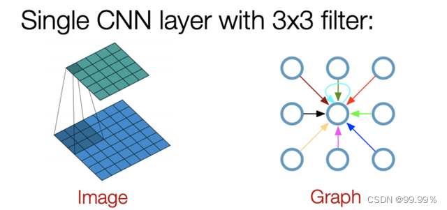

+++
title = '图神经网络学习笔记（1）'
date = 2024-04-07T23:41:06+08:00
tags = ["机器学习", "图神经网络", "学习笔记"]
draft = false
+++

## 图网络

### 背景

​常见的神经网络，如BP神经网络可以用来处理表格型的数据，卷积神经网络可以用来处理图片数据，循环神经网络则可以用来处理序列数据，这些数据都是结构化的数据，当我们需要处理的数据为图这种**非结构化**的数据，例如：城市交通的每个路口上的传感器所记录的数据；化学分子结构；人际关系网；推荐系统中每个人构成的图。并不是说以上的神经网络处理不了图这种类型的数据，只是在处理图这种数据上存在欠缺，图数据有一个很明显的特征，相邻或相近的节点存在一定的空间依赖关系，这种关系传统神经网络很难捕获。为了获取表示这种特征关系，图网络就此诞生。

### 内容

​图网络的核心思想就是**依据图结构的空间依赖关系来表征现实世界中真实的特征之间的相互作用关系，通过对节点特征进行聚合生成新的节点特征表示**用于后续工作。

​下图为一张交通系统的图结构，在6个位置上分别有一个传感器记录了一段时间的交通流量数据，现在的目标是要预测接下来每个位置上未来一段时间的流量。如果从传统的时间序列模型来思考，未来的数据一定是与过去的数据相关，因此我们可以对6个位置的时间序列单独进行预测生成6个位置未来的预测值，但是这样就没有考虑到节点之间的空间依赖关系。既然已经用图结构表示出了这种空间关系，那么我们怎么去应用它？这就是图网络所要解决的问题。

## GCN(Graph Convolutional Network)

>  论文：https://arxiv.org/pdf/1609.02907.pdf

​GCN（图卷积神经网络），实际上跟CNN（卷积神经网络）的作用一样，就是一个特征提取器，只不过它的对象是图数据。GCN精妙地设计了一种从图数据中提取特征的方法，从而让我们可以使用这些特征去对图数据进行节点分类（node classification）、图分类（graph classification）、边预测（link prediction），还可以顺便得到图的嵌入表示（graph embedding）。下图为GCN和输入图像数据的CNN间的对比。

### 常规邻接矩阵

假设有一批图数据，其中有N个节点（node），每个节点都有自己的特征，假设特征一共有D个，我们设这些节点的特征组成一个N×D维的矩阵X，然后各个节点之间的关系也会形成一个N×N维的矩阵A，也称为邻接矩阵（adjacency matrix）。X和A便是我们模型的输入。

假设现在有这样一个图结构，有ABCDE五个节点，每个节点之间的相互关系以及每个节点的特征如下图。

现在我要重新计算E的特征，根据GCN的基本思想，就是要聚合其邻居节点的信息，也就是ABCD的特征以一定方式进行聚合（平均、求和、拼接等），以求和为例：

因为E和ABCD四个节点都相连，因此其聚类后的新特征为ABCD四点对应特征之和。而如果将其放在矩阵乘法运算中则为邻接矩阵和特征矩阵的乘积：

设n为节点数，f为每个节点的特征维度，则邻接矩阵A的形状为 (n,n) ,特征矩阵的形状为 (n,f) ，AX相乘后表示考虑到邻居节点信息的新的特征矩阵，形状为 (n,f) ，每一行表示一个节点的特征，可以看出新的E节点，我们能一次性将所有的节点特征表示出来。

#### 考虑自身信息的邻接矩阵

刚刚提到的常规的邻接矩阵的中，两个不同的节点B和C在经过邻接矩阵的运算后，新的特征向量完全一致，然而这是两个具有不同位置信息、不同特征的不同节点，得出来一样的结果明显是不合理的。因此为了防止这种情况，在计算新的节点特征时，不仅要考虑邻居节点的信息，也可以将自身节点的信息考虑进去。在邻接矩阵上面的表现就是加上了一个单位阵：
$$
\tilde A = A + I
$$

接着将得到的新邻接矩阵与特征矩阵相乘的到新的特征矩阵

可以看出，加入单位矩阵之后，B和C虽然具有相同的邻居，但是由于自身的特征不一样，所以空间变换后的特征也不一样。单位矩阵的加入，使得矩阵相乘时，考虑到了自身节点的信息的因素。

#### 求平均/归一化

采用之前的方式，相当于我们对所有节点的邻居及自身进行了求和，但是这种聚合方式是有问题的，相当于我们变相的改变了特征的量级。我们每进行一次聚合，就加大了一次量级。随着迭代的增加，量级会越来越大，假设现在我要求小明的收入，那么采用求和的方式就会将小明的邻居朋友们及自己的收入加起来，这显然是错误的。因此更好地方式是求平均，类比到图结构中就是左乘我们的度矩阵。

其中度矩阵就是与该节点相邻节点的数据，因此就是邻接矩阵A每一行的求和组成的对角阵
$$
D=\Sigma_jA_{ij}
$$

同样的这种方式也只考虑到了邻居节点的个数而没有考虑到自身的信息，因此在度矩阵D上在加上单位阵 I ，也即$\tilde A$的每一行的求和，即：
$$
\tilde D=D+I=\Sigma_j\tilde A_{ij} 
$$

所以最终的求平均的操作就为 $ \tilde D^{-1}\tilde AX$，由于矩阵乘法满足结合律，所以 $ \tilde D^{-1}\tilde AX = \tilde D^{-1}(\tilde AX)$，又由于 $ \tilde D^{-1}$ 为初等矩阵，左乘初等矩阵相当于行变换，所以相当于对$ \tilde AX $的每一行除以度，相当于对每一个节点求和后的特征做平均。

这就是邻接矩阵的归一化。