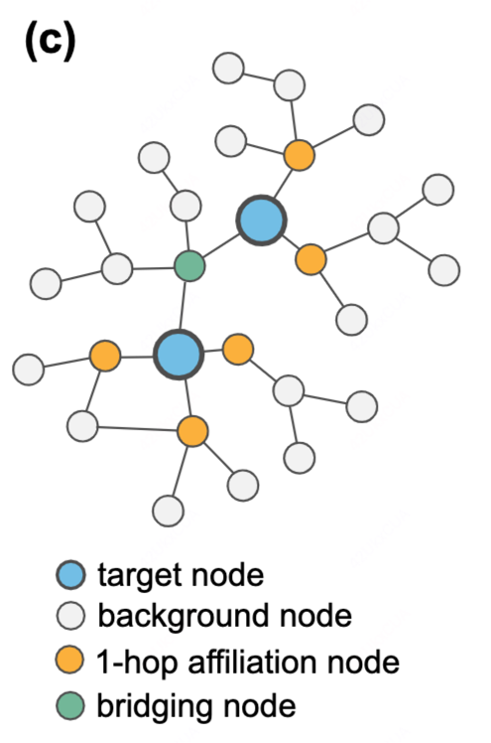

+++
title = '图神经网络学习笔记（3）——Graph Skeleton'
date = 2024-09-20T11:10:15+08:00
tags = ["机器学习", "图神经网络", "学习笔记"]
draft = false
+++

# Graph-Skeleton: ∼1% Nodes are Sufficient to Represent Billion-Scale Graph论文阅读

>  论文：https://arxiv.org/abs/2402.09565

## Abstract

图数据的在网络上的普遍存在让其有着很广泛的应用，包括网页搜索、社交网络分析、区块链、推荐系统、交通流预测等。然而，在大规模网络图上部署图模型仍然是一个巨大的挑战。尽管有许多研究致力于提高图模型的可扩展性，但学术研究与工业场景之间仍然存在明显的差距。一个主要原因是，在大多数工业场景中，网络图中的只有一小部分节点需要被分析，我们称这些节点为**目标节点**，而其他节点为**背景节点**。   

在本文中，我们提出，通过从海量网络图数据中合理获取并压缩背景节点，可能是从根本上解决这些障碍的更经济的捷径。为此，我们首次尝试研究目标节点分类中的大规模背景节点压缩问题。通过广泛的实验，我们揭示了背景节点在目标节点分类中扮演的两个关键角色：增强目标节点之间的结构连通性，以及与目标节点的特征相关性。基于此，我们提出了一种新颖的Graph-Skeleton模型，该模型合理地获取背景节点，并进一步压缩相似目标-背景局部结构中背景节点的语义和拓扑信息。在各种网络图数据集上的大量实验表明了该方法的有效性和效率。特别是在包含2.4亿个节点的MAG240M数据集上，我们生成的骨架图在仅包含原始图1.8%节点的情况下，仍然实现了高度可比的性能。

## Introduction

图数据的普遍存在，尤其是在网络图形式下，使得网络图挖掘成为一个热门的研究话题。这些网络图在诸多应用中至关重要，包括网页搜索、社交网络分析、区块链、推荐系统等。然而，在大规模网络图上部署图模型仍然是一个巨大的挑战。实际上，网络图数据可能极其庞大。以Facebook为例，每月有超过29.3亿的活跃用户。

尽管在提升图模型在大规模网络图挖掘任务上的可扩展性方面已经取得了显著进展，例如节点采样、模型简化等，但学术研究与实际应用之间仍然存在很大的差距。一个主要原因是在大多数工业场景中，并非网络图中的所有节点都需要被分析。

我们以DGraph（一个真实的金融与社交网络数据集，用户作为节点，用户之间的社交关系作为边）为例，进一步说明这一点。以贷款用户中的欺诈者识别任务为例，只有那些有贷款记录的用户需要被分类，而没有贷款行为的其他用户则不需要。在这种情况下，我们将贷款用户称为目标节点，而将其他用户称为背景节点。这种目标与背景的属性在网络图挖掘场景中普遍存在。此外，背景节点的数量通常远远大于目标节点。例如，在MAG240M数据集中，要预测论文的学科领域，只有140万篇Arxiv论文需要被分类，而总节点数却有2.4亿个。

## Empirical Analysis

### 两个疑问

1. 背景节点对于目标节点的分类是否是必要的？ 
2. 背景节点在目标节点的分类中发挥什么作用？

为了回答这两个问题，作者使用SAGE、GAT、GIN三种采用不同聚合方式（求平均、加权求和、求和）的用于进行分类任务的模型对以上疑问进行分析。

### 数据集

1. 金融贷款网络 DGraph：我们遵循原始数据集的任务设置，即在贷款用户中识别欺诈者，因此有贷款行为的用户被视为目标节点（约33%），而其他用户则为背景节点。
2. 学术引用网络 ogbn-arxiv：我们旨在预测2018年以后发表的论文的学科领域，在这种情况下，2018年后发表的论文被视为目标节点（约46%），而2018年之前的论文则为背景节点。

**对于疑问一：**

尝试进行随机切割边、切割所有边B-B、切割所有边T-B、切割所有边T-T，并与原始的图进行对比。最终发现，切割T-B、T-T均会对预测准确率有显著下降，而切割B-B则不会，甚至在某些数据集上还有提升。

**对于疑问二：**

实验发现对于连接了两个T的B(桥接节点)，如果删除了这些T-B边(BridB)，模型预测的准确率会有显著下降，说明这些T-B关系对于模型的性能具有显著贡献。另外，从图中的结果可以看出，切割BridB的效果均好于T-B，说明维持T-T之间的连通性也是十分有必要的。

### 其他猜想

假设背景节点与其相似的目标节点之间具有更高的特征相关性，为此计算了目标节点与其不同跳数的背景节点之间的Pearson系数。从结果来看，越靠近目标节点的背景节点往往会具有更高的相关性。这表明与单个目标相邻的背景节点的特征可能与目标本身的特征相关，从而影响模型的性能。

### 分析结论

1. 大多数背景节点是多余的
2. 背景节点在目标节点分类任务中以如下两种方式发挥作用
    1. 作为桥接节点(brige)提供目标节点之间的联通性
    2. 与单独的目标节点相连，作为关联节点(affiliation)提供特征相关性

## Methodology

### 问题定义

在大规模图$G = (V, E)$ 中，针对一个特定的节点分类任务，我们可以得到一个相应的节点集合 $T = \\{T_1, T_2, \dots, T_n\\}$，其中包含了需要进行分类的节点。在大多数实际场景中，节点集合 $T$ 的大小远小于图中所有节点的总数 $|V|$。

在这篇论文中，我们将 $T$ 称为**目标节点**(target nodes)，而图 $G$  中的其他节点则称为**背景节点**(background nodes)，记作 $B := V \setminus T = \\{B_1, B_2, \dots, B_{|V| - n}\\}$。图 G 同时还与节点特征 $X \in \mathbb{R}^{|V| \times d}$ 和目标节点标签$Y\in \\{0, \dots, C - 1\\}^n$相关联。考虑到大多数节点都是背景节点，我们的**目标**是**生成一个具有高度信息量的合成图 $G'$，同时显著减少背景节点的数量。**除此之外，论文主要关注对目标节点的分类情况，因此**仅对背景节点进行压缩**，而**保留了所有原始的目标节点。**

### 框架概述

为了应对大规模网络图中的问题，作者提出了一种新颖的**Graph-Skeleton**框架，用于从庞大的网络图中生成一个具有更小规模但信息丰富的骨架子图(skeleton subgraph)，以便进行目标分类。

- **第一步-节点提取**：框架首先提取所有的目标节点以及部分背景节点，构建一个基础子图(vanilla subgraph)。作者根据结构连通性和特征相关性提出了一种提取原则，来合理提取对应的节点。（**下图Node Fetching部分）**
- **第二步-图凝聚**：Graph-Skeleton对基础子图的信息进行压缩，以减少冗余。具体来说，作者设计了三种图凝聚策略（即𝛼, 𝛽, 𝛾），压缩程度从低到高不等。（**下图Graph Condensation部分）**
- **第三步-分类任务**：压缩后的图具有高度的信息量，同时享有小规模带来的存储和图模型部署的优势。可将其应用于各种GNN模型进行分类任务。

### 1. 节点提取

上一部分得出的结论是**背景节点是高度冗余**的，因此初步的想法是进行关键节点的提取，从庞大的原始数据中适当地提取桥接和关联背景节点。利用这些节点，我们可以构建一个包含所有目标节点以及一小部分背景节点的**初始子图**(vanilla subgraph)。

为了解决过度扩展问题，为了解决过度扩展问题，我们根据自定义的节点提取深度和宽度(即 $d_1、d_2、K \in \mathbb{N}$)进行节点的提取。具体遵循以下两个原则：

1. **结构连通性**：在$d_1$跳内连接两个或多个目标节点的视为**桥接节点**进行保留。
2. **特征相关性**：对于每个单独的目标节点，在$d_2$跳范围内，与目标节点特征相关性最高的$K$个背景节点视为**关联节点**进行保留。

因此首要目标是找到每个目标节点的所有可访问的背景节点(可访问指的是可从**仅由背景节点**组成的路径到达)。

*本论文中将超参数规定为$d_1=3, d_2=1,k=2$

**对于原则1-结构连通性**：

1. **找背景节点**：通过对每个目标节点使用BFS找所有可到达的背景节点
2. **找最短路径**：假设背景节点 $B_j$ 可以访问目标节点集合为$\\{T_{k1}, T_{k2}, ..., T_{ki}\\}$，则对应的最短路径集可以表示为 $P_{Bj} = \\{p_{k1,j}, p_{k2,j}, ..., p_{ki,j}\\}$，计算这些路径长度$d(P_{Bj}) = \\{d(p_{k1,j}), ..., d(p_{ki,j})\\}$ （其中 d(t) 是距离函数），并将这些路径长度的最小值和第二小值相加，得到$sd_j = \min [ d(P_{Bj}) ] + \min 2nd [ d(P_{Bj}) ]$
3. **判断是否为桥接节点**：如果$sd_j≤d_1$，这意味着背景节点 $B_j$ 在 $d_1$跳范围内至少连接了两个目标节点，因此将其视为桥接节点。

通过遍历所有背景节点，可以得到一个包含所有**桥接节点**的节点子集$BR$。

**对于原则2-特征相关性**：

1. **找背景节点**：通过对每个目标节点 $T_i$ 执行BFS，获得 $T_i$ 到其所有可访问背景节点的最短路径集合。设 $J := \\{ j_1, j_2, ..., j_k \\}$ 为 $T_i$ **可访问背景节点的索引集合，对应的最短路径集合为 $P_{T_i} := \\{ p_{i,j} \\}$，其中 $j \in J, p_{i,j}$ 表示从 $T_i$ 到某个可访问背景节点 $B_j$ 的最短路径。
2. **判断距离**：选择那些最短路径距离在 $d_2$ 以内的可访问背景节点，即 $\\{ B_m, m \in J, s.t., d(p_{i,m}) \leq d_2 \\}$
3. **计算相关性**：为了选择最重要的 $K$ 个背景节点，我们需要计算每个被选中的 $B_m$ 与 $T_i$ 之间的特征皮尔逊相关系数 (PCC):

$$
PCC_im=\frac{cov(X[i],X[m])}{σ_{X[i]}⋅σ_{X[m]}}
$$

4. **筛选关联节点**：选择相关性最高的$K$个背景节点作为**关联节点。**

通过遍历所有目标节点，可以获得一个关联背景节点子集 $AF$。

**构建子图：**

将目标节点 $T$ 和抓取到的背景节点$B' = \\{ BR, AF \\}$ 保留在原始图 $G$ 中，构建一个子图 $G' = (V', E')$

### 概念定义

为了减少信息冗余，我们为构建的原始子图 $G'$ 设计了一个凝缩过程，有效地凝缩了结构信息和语义信息。具体来说，我们提出了三种图凝缩策略，分别标记为 $\alpha$、$\beta$ 和 $\gamma$，它们提供了从低到高不同程度的凝缩效果。

1. **$MSS$(multiple structure-set, 多重结构集)**：背景节点$j$可前往的所有目标节点的集合及到达该节点的距离

$$
MSS_j=\\{{⟨T_i,d_{i,j}⟩,...,⟨T_{k},d_{k,j}⟩}\\}
$$

2. **节点对等价类(Node Pair Equivalence Class)**：给定图 $G$ 上的函数族 $F$，定义所有图节点对之间的等价关系 $\simeq _F$，使得对于所有 $u, v \in V$，当且仅当 $\forall f \in F，f(G,X) = f(G, \tilde{X})$，其中 $\tilde{X}$与 $X$ 相同，但 $\tilde{X}[u] = X[v]$ 和 $\tilde{X}[v] = X[u]$。
   
    即对于图上两个节点交换两个节点特征后函数返回相同的结果，则这两个节点对等价
    
3. **线性消息传递(Linear message passing operation, $lmp$)** 给定两个连接的节点 $u$ 和 $v$，定义从 $u$ 到 $v$ 的线性消息传递操作$f_{lmp}(u, v)$ 为：

$$
X'[v] \leftarrow f_{lmp}(X[v], X[u]) = \text{AGGREGATE}(\\{X[v], X[u]\\})W
$$

其中 $W$ 是一个变换矩阵，$\text{AGGREGATE}$  可以表述为逐元素均值或求和池化。

4. **线性路径消息传递(Linear message path passing)**：给定一条路径 $p = \langle u_0, u_1, ..., u_\ell \rangle$，对于所有 $u_i \in V$，定义从 $u_0$ 到 $u_\ell$沿路径 $p$ 聚合节点特征的线性路径传递函数 $f_{spp}(X, p)$为：

$$
X'[u_i] \leftarrow f^i_{lmp}(X'[u_{i-1}], X[u_i])W_i, \quad i \in 1, ..., \ell
$$

5. **线性路径消息传递等价类(Linear message path passing equivalence class，LMPP等价类)：**
   
    给定一组线性路径消息传递函数$LMPP$，两个节点$u, v \in V$ 和一个共同可达节点$K \in V$，对应的路径分别为$p_{u,K} := \langle u, ..., K \rangle$ 和$p_{v,K} := \langle v, ..., K \rangle$，令$P := \\{p_{u,K}, p_{v,K}\\}$，定义$u_{LMPP,K}\simeq v$ 的LMPP等价关系为：
    
$$
u_{LMPP,K} \simeq v⟺∀f_{lmpp}∈LMPP,f_{lmpp}(X,P) =f_{lmpp}(\tilde X,P)
$$
    

其中 $\tilde{X}$与 $X$ 相同，但 $\tilde{X}[u] = X[v]$ 和 $\tilde{X}[v] = X[u]$。

6. 设 $T \in \text T$ 表示图 $G$ 中的一个目标节点，$B$ 表示背景节点的集合，对于所有 $u, v \in B$，如果 $MSS_u = MSS_v \neq \emptyset$那么$u_{LMPP,T} \simeq v$
   
    若两节点的mss相同，则它们lmpp等价
    

### 2. 图凝聚策略

1. **策略-𝛼**：因为具有相同mss的背景节点沿路径进行聚合的方式类似，聚合得到的结果也类似。将所有具有相同mss的背景节点进行聚合压缩，变为一个合成节点。给定一个背景节点的集合$ B_k^{'}=\\\{B_i,...,B_j\\\} $，这些节点之间具有相同的$MSS$，将要聚合到的点$ B_k^{'} $ 的特征 $ x_{B_k^{'}} $为：

$$
x_{B^′_k}← \text {AGGREGATE}({x_v,∀v∈B^′_k})
$$

$\text{AGGREGATE}$  可以表述为逐元素均值或求和池化。

2. **策略-𝛽**：策略-𝛼通过多重结构集（MSS）凝聚具有相同结构信息的背景节点，但其压缩效果有限，因为只有一部分严格共享相同的 $\\{\langle T, d \rangle\\}$的背景节点会进行聚合。为提高效率，修改mss为$MSS_j^{'}=\\\{{⟨T_i⟩,...,⟨T_{k}⟩}\\\}$，并在此基础上进行节点的聚合。
   
    但是需要注意的是，在将背景节点合并压缩时，图的相对距离信息可能会丢失。具体来说，当多个桥接节点被合并成一个节点时，原本距离较远的目标节点之间的相对距离会缩短。例如，原本相隔几跳的目标节点，在压缩后的图中可能通过一个1跳的桥接节点连接在一起。
    
    对于一个与 $B_k^{'}$ 通过边$e_{m,k}^{'}$ 连接的可达目标节点 $T_m$，设 $B_k^{'}$ 到 $T_m$ 的最短距离集合为$D_m := \\\{d_{m,i}, ..., d_{m,j}\\\}$。那么边 $e_{m,k}^{'}$ 的权重$w_{m,k}^{'}$ 可以表示为：
    
    $$
    w_{m.k}^{'}= \sum _{d\in D_k}\frac{1}{d}
    $$
    

3. **策略-γ**：尽管策略-β有效地减少了桥接节点的数量，但在进一步凝聚关联节点方面仍有改进的空间。给定一个原始子图$G^′$，我们首先执行策略-β来凝聚桥接节点，然后在生成的骨架图$S_β$中凝聚关联节点。具体而言，给定$S_β$中的一个目标节点$T_𝑘$，以及其对应的关联背景节点集$AF_𝑘$，我们通过将$T_𝑘$的特征与$AF_𝑘$的特征进行整合来更新$T_𝑘$的特征，然后在$G^′$中移除$AF_𝑘$。
   
    通过这种方式，我们在去除大量关联节点的同时，保留了大部分来自关联节点的原始相关信息。凝聚后$T_𝑘$的特征$x_{T_k}$是通过与$AF_𝑘$的原始特征聚合而成的，具体公式如下：
    
    $$
    x_{T_k} \leftarrow \text{AGGREGATE}\left(\\{x_{T_k} \cup \\{x_u,  \forall u \in AF_k\\}\\}\right)
    $$
    

许多具有代表性的图神经网络（GNNs）采用传播过程来合并来自邻居节点的信息。直观上，直接将关联节点的特征聚合到相邻的目标节点上，会与递归聚合（即通过多次传播过程逐步聚合信息）的结果相似。

## Experiments

### 实验准备

为了全面评估所提出的 Graph-Skeleton 的性能，我们在六个 Web 数据集上进行了目标节点分类任务：DGraph、ogbn-mag、ogbn-arxiv、MAG240M、DBLP 和 IMDb，只考虑删除所有的背景节点的情况。数据集的规模如下：

### baseline方法

在实验设置中，我们将目标节点分类性能与原始图和其他图压缩基线方法进行了比较，包括核心集方法（随机、使用PageRank中心性的中心性排序（Central-P）和使用度中心性的中心性排序（Central-D））、图粗化方法（变异邻域粗化（GC-VN）、代数JC粗化（GC-AJC）、使用舒尔补数的谱粗化（SchurC））、图凝聚方法（GCond、DosCond）以及图主动学习方法（GPA）等。需要注意的是，我们的目标是**在压缩背景节点的同时保留所有目标节点**。压缩率通过背景节点压缩率（BCR）来表示，即合成背景节点与原始背景节点的比例。

在通过上述方法获得压缩图后，我们采用图神经网络（GNNs）来评估其目标分类性能。考虑到不同的数据集适用于不同的GNNs，对于DGraph、ogbn-arxiv、ogbn-mag和MAG240M，我们选择各自官方排行榜上表现最好的GNNs进行评估。对于IMDB和DBLP，我们采用最具代表性的GNNs（GCN、GraphSAGE、GAT）进行评估。DGraph的目标分类性能通过AUC（%）来评估，其他数据集则通过ACC（%）来评估。

### 图压缩对比

我们首先在表2中报告了在固定压缩率（BCR）下，压缩图在六个数据集上的目标节点分类结果。在此，我们将使用策略-𝛾的Graph-Skeleton（简称Skeleton-𝛾，具有最高压缩率）的性能与其他基线方法进行了比较。

正如我们所见，Skeleton-𝛾在将GNNs扩展到所有数据集方面表现出强大的能力。此外，在相似的BCR下，它还比其他压缩基线方法实现了更优越的目标分类性能。此外，与其他因内存和计算负担严重受限的图粗化和压缩方法相比，我们的方法在部署于大规模网络图时更具友好性。值得注意的是，与原始图相比，Skeleton-𝛾在显著减少背景节点数量的同时，也表现出高度可比甚至更好的目标分类性能。

此外，我们在图6中报告了压缩图在不同BCR（背景节点压缩率）下的目标分类结果。通过选择Graph-Skeleton的不同压缩策略以及不同的节点抓取深度（𝑑1, 𝑑2），我们可以灵活地实现不同的压缩率。可以很容易地观察到，在更广泛的压缩率范围内，我们的方法显著优于其他方法。

### 存储消耗对比

我们报告了在固定背景节点压缩率（𝐵𝐶𝑅）下，原始图和Skeleton-𝛾在六个数据集上的网页图存储的内存成本。为了更直观地呈现结果，我们将图数据的存储成本分解为三个主要方面：目标节点特征的成本、背景节点特征的成本和图的邻接矩阵的成本。结果如表3所示。可以看到，Skeleton-𝛾显著减少了背景节点特征和图邻接矩阵的内存成本（表3中的绿色部分）。由于在压缩后的Skeleton-𝛾中保留了所有的目标节点，目标节点特征的存储成本与原始图保持一致。另一方面，Skeleton-𝛾还在性能上达到了与原始数据接近甚至更好的效果。这突显了我们提出的方法在保留目标节点分类所需的关键信息方面的有效性。

### 三种图凝聚策略对比

我们研究了Graph-Skeleton提出的三种压缩策略𝛼、𝛽和𝛾的压缩性能。具体来说，我们使用相同的基础子图作为输入，并采用这三种策略进行压缩。图中左轴（蓝色）表示背景节点压缩率（𝐵𝐶𝑅，柱状图），右轴（红色）表示目标节点分类性能（虚线）。正如我们所见，Skeleton-𝛼、𝛽、𝛾在目标节点分类性能上都与原始数据表现出极具竞争力的效果，表明这三种压缩策略的有效性。通常来说，Skeleton-𝛼在三种策略中表现出最佳的分类性能，这是由于信息损失较少。另一方面，Skeleton-𝛾在所有测试的下游GNN中也很好地逼近了原始性能，同时具有显著更高的𝐵𝐶𝑅，表明将附属背景节点的特征聚合到相邻目标节点上可以很好地保留原始背景节点的信息。

## 拓展与思考

图压缩的策略能否用于表示路网结构，以解决ETA相关问题？

### ETA背景下交通图特点

1. **数据量大：**交通图包含时空两个维度的数据，以北京为例，其包含**`2733734`** 条link，单日数据维度 **2733734 * 1440**，难以直接以图的方式输入模型计算
2. **时间空间特征明显：**交通图在时间上和空间上均存在明显特征。时间上，从星期来看存在工作日和休息日的星期差异；从天来看存在早晚高峰和其他时段的时间差异。空间上，某一路段周围道路的路况变化往往会对其造成影响；一条路段上的多个link存在前后关联
3. **存在大量数据冗余：**以北京20240801数据为例，当日无路况发布的link为**`2033166`** (约占74%)，这些link在图中的作用仅仅表现为图结构上的联通性

### 有何思路可以借鉴？

1. 学习论文中**节点提取**的思想，只保留具有**结构连通性**和**特征相关性**的link构成图结构
2. 学习论文中**图凝聚**的思想，构建不同link的**特征相关函数**，并依据相关性进行link聚合

