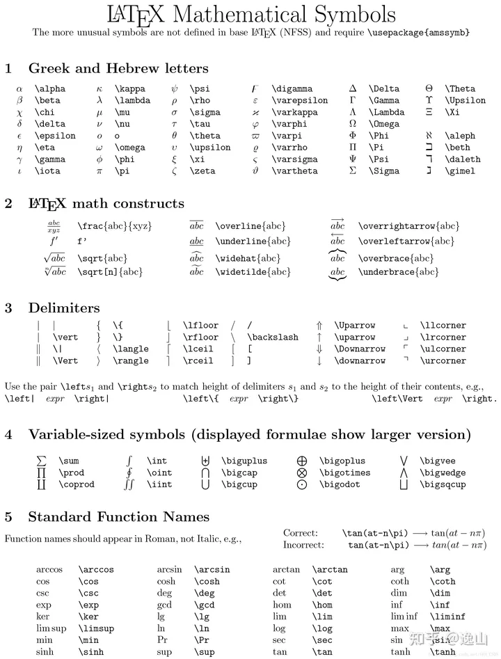
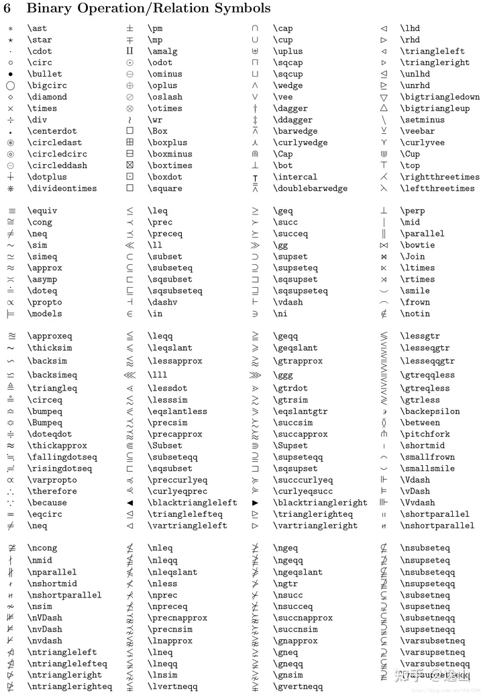
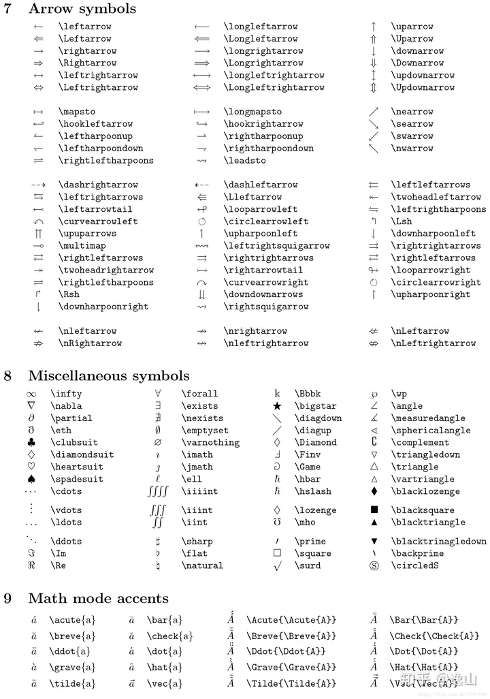

+++
title = 'Latex Symbol Quick Reference Guide'
date = 2024-04-11T17:55:39+08:00
draft = false
+++

In the process of writing papers, creating presentations in PowerPoint, and editing documents in Word, Markdown, and Latex, we often encounter issues with remembering how to edit certain symbols. Here, I'm reposting some content from the Latex documentation for easy reference.

## Part 1：Greek/Hebrew characters, mathematical construction symbols, separators, variable length symbols in formulas, standard functions

## Part 2：Binary operators and relational symbols

## Part 3：Arrows, calculus sets, musical notes, mathematical mode accents

## Part 4：Array environment, other mathematical styles, font sizes, text accent symbols

