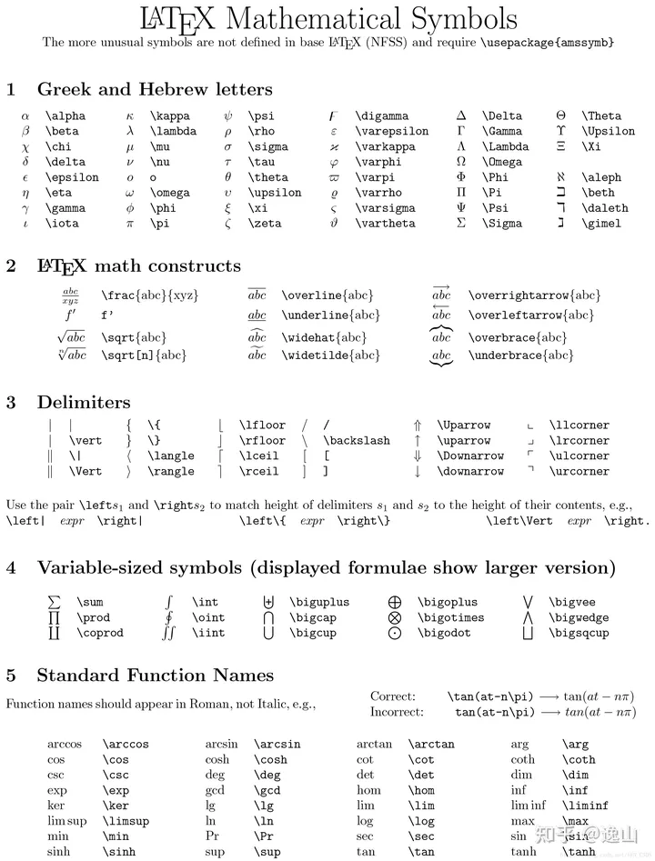
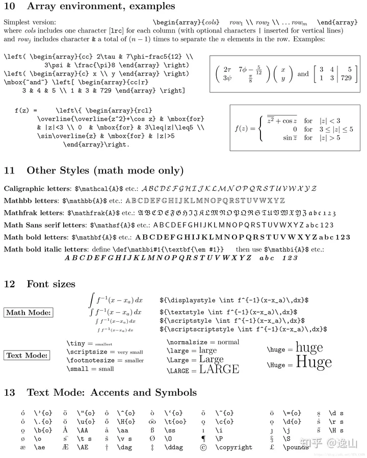

+++
title = 'Latex相关符号速查手册'
date = 2024-04-11T17:55:39+08:00
draft = false
tags = ["Latex", "Markdown"]
+++

在论文编写，ppt，word，Markdown，Latex等文档编辑过程中经常会遇到一些符号编辑记不住的问题，这里转载一下latex说明文档上的一些内容，方便自查。

## Part 1：希腊/希伯来字符、数学构造符号、分隔符、公式中可变长度的符号、标准函数

## Part 2：二元运算符和关系符号

## Part 3：箭头、微积分集合、音乐符、数学mode声调

## Part 4：Array环境、其他数学风格、字体大小、文本声调符号

